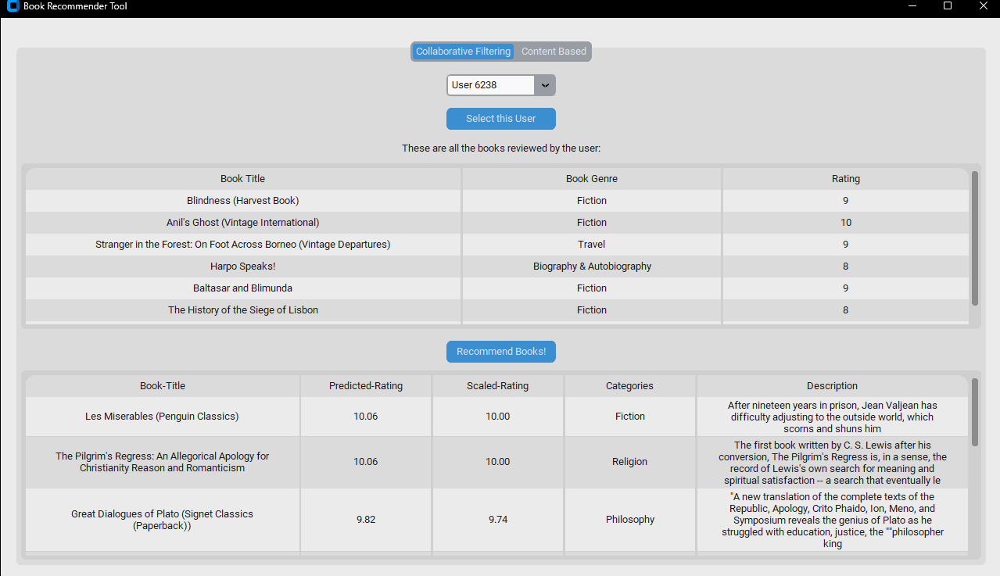

# book-recommender
A Book Recommender System - Using both Content-Based and Collaborative Filtering approaches
Built using Python with libraries such as sklearn, pyspark, pandas, numpy etc. + GUI using tkinter

## GUI Screenshots

 

## For the Content-Based Approach:
- Count Vectorizer
- Tf-Idf (Term frequency - Inverse Document Frequency)
- Word2Vec Model

## For Collaborative Filtering:
- ALS (Alternating Least Squares)

## Dataset used: 
A merge between Abdallah Wagih Ibrahim’s [Books Dataset](https://www.kaggle.com/datasets/abdallahwagih/books-dataset/data). and Zygmunt Zajac [Goodreads 10k](https://github.com/zygmuntz/goodbooks-10k).
We obtained over 2.4k book entries with metadata about the books and user reviews, used for the recommendation process
